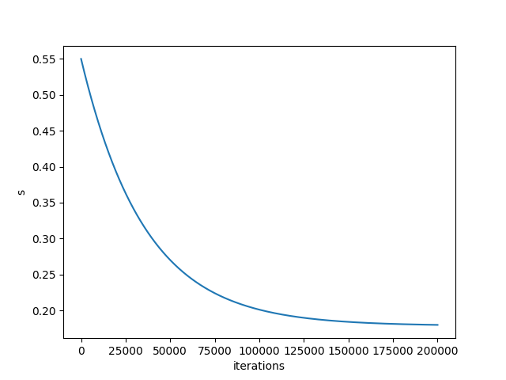

# Synaptic strength converges to fixed point

# Requirements

Python3, numpy, matplotlib

# Example

Stimulus x = 0.8

Synaptic plasticity function $f(xs)= 0.9xs+0.05$, whose fixed point is around $s=0.17857$

